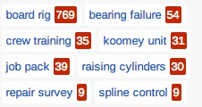

       88                       88  
       ""                       ""  

       88 ,adPPYba, 88       88 88  
       88 I8[    "" 88       88 88  
       88  `"Y8ba,  88       88 88  
       88 aa    ]8I "8a,   ,a88 88  
       88 `"YbbdP"'  `"YbbdP'Y8 88  
      ,88
    888P"    - Custom components


Custom components made for [Coveo jsui framework](https://developers.coveo.com/display/JsSearch/Home),
 some of them may require tweaking / additionnal scripting or even whole styling.


## Components

- [CoveoPopularQuerier](#coveopopularquerier)
- [CoveoSimpleRelatedResults](#coveosimplerelatedresults)

### CoveoPopularQuerier

A component that queries and doesnt show results, instead it triggers and event (`dataloaded`)
which gives you an array of objects:

```json
[
 ...,
 {
 "field": "@txtannovtheme",
 "value": "Inspection",
 "score": 18172
  },
  ...
]
```
Usage (with jquery):

```js
$("#popularquerier").on("dataloaded",function(e, results, query){
  // DO stuff
  console.log(results,query)
})
```


### CoveoSimpleRelatedResults

CoveoSimpleRelatedResults makes a query similar to a CoveoFacet but can be
provided additionnal query parameters or completly new ones.


