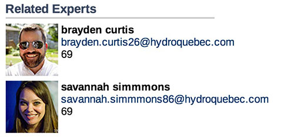

       88                       88  
       ""                       ""  

       88 ,adPPYba, 88       88 88  
       88 I8[    "" 88       88 88  
       88  `"Y8ba,  88       88 88  
       88 aa    ]8I "8a,   ,a88 88  
       88 `"YbbdP"'  `"YbbdP'Y8 88  
      ,88
    888P"    - Custom components


Custom components made for [Coveo jsui framework](https://developers.coveo.com/display/JsSearch/Home),
 some of them may require tweaking / additionnal scripting or even whole styling.


## Components

- [CoveoPopularQuerier](#coveopopularquerier)
- [CoveoSimpleRelatedResults](#coveosimplerelatedresults)
- [CoveoRelatedResults](#coveorelatedresults)
- [CoveoQEXRelatedResults](#coveoqexrelatedresults)
- [CoveoTimeGraph](#coveotimegraph)
- [CoveoResultsRelated](#coveoresultsrelated)
- [GoogleMap](#coveogooglemap)

### CoveoPopularQuerier

A component that queries and doesnt show results, instead it triggers and event (`dataloaded`)
which gives you an array of objects:

```json
[
 ...,
 {
 "field": "@txtannovtheme",
 "value": "Inspection",
 "score": 18172
  },
  ...
]
```

Usage (with jquery):

```js
$("#popularquerier").on("dataloaded",function(e, results, query){
  // DO stuff
  console.log(results,query)
})
```


### CoveoSimpleRelatedResults

CoveoSimpleRelatedResults makes a query similar to a CoveoFacet but can be
provided additionnal query parameters or completly new ones.


### CoveoRelatedResults

CoveoRelatedResults makes two queries, one to get the list related elements and
the second one to actually get the information about the related elements which
usually are of another type.



### CoveoQEXRelatedResults

Like [CoveoRelatedResults](#coveorelatedresults), this one is using only
[query extension language](https://developers.coveo.com/display/SearchREST/Query+Extension+Language)


### CoveoTimeGraph

### CoveoResultsRelated

Will show a related results section at a result level. Like we show attachments for emails.
Here you can use your own query with results from the current result.
Query can be constructed like: @sysauthor='[FIELD1]' @syslanguage='[FIELD2]'
Then the fields section will look like: sysauthor;syslanguage
Show Always will always show the related section, without the need to open it.
<div class="CoveoResultsRelated"
               data-result-template-id="RelatedResultsTemplate"
               data-normal-caption="Show Related Files"
			   data-title-caption="Related Files based upon the same author"
               data-expanded-caption="Do not show Related Files"
               data-no-results-caption="No related files found"
			   data-query="@sysauthor=[FIELD1]"
			   data-fields="sysauthor" 
			   data-number-Of-Results=5 ></div>
			   
### CoveoGoogleMap
Will show a googlemap with all the results plotted on it. It assume's there are two fields containing the lat/lon.
After zooming in/out/panning the map will redraw and the boundaries will be used to filter the search results.
Clicking on a point will act as a filter (using a query function) to only show items within 1000 m of the selected point.
